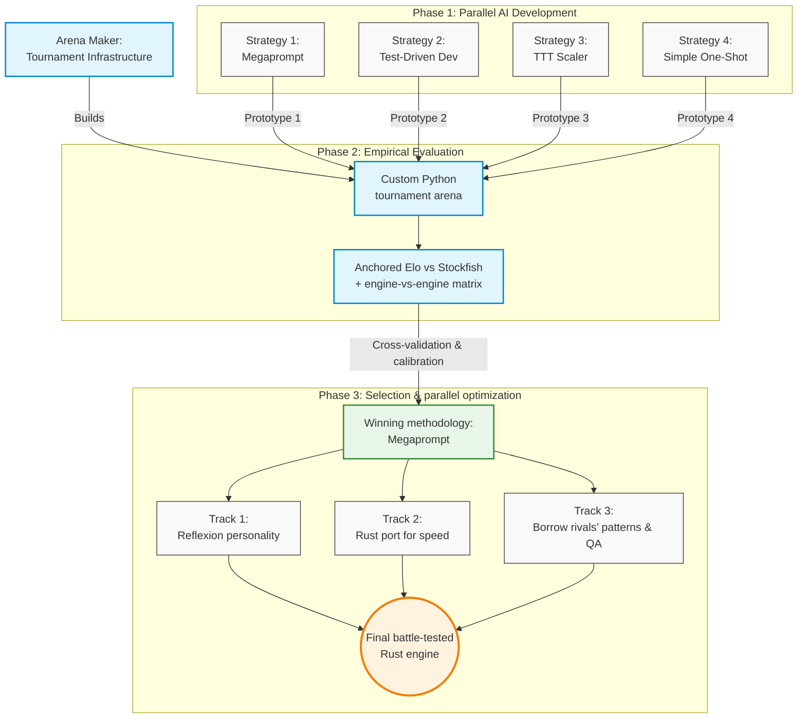
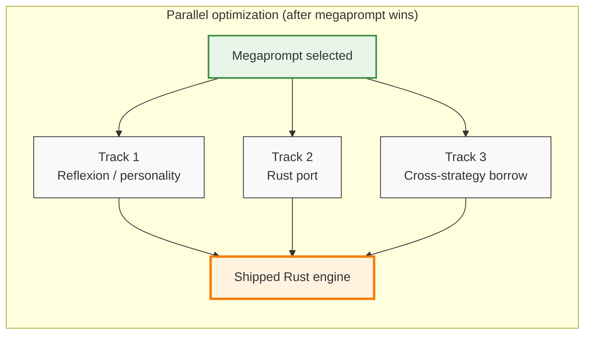

# Cubist Systematic Hackathon: Optimizing AI-driven Strategies 

## 1. Introduction

Yesterday at 6:00 pm, we were given an open-ended prompt to build a chess engine. However, being research-oriented students, we decided to approach the challenge not as a standard software engineering sprint, but as a rigorous quantitative research project. We realized that simply asking a Large Language Model to generate code would yield average results at best. Instead, we wanted to empirically discover the optimal way for human developers to collaborate with AI.

Our plan was to formulate four entirely distinct, AI-driven development strategies and use them in parallel to generate prototype engines. To evaluate them, we built a custom tournament arena to force these prototypes to compete against each other. By treating the prompting methodologies themselves as variables in a measurable experiment, we could systematically evaluate their logic, code stability, and compute efficiency. Only after cross-validating their performance and identifying the statistically superior approach would we use those insights to optimize our final, battle-tested chess engine.



## 2. The Four Prompting Methodologies
To eliminate bias and establish a proper control, we isolated our development into four distinct tracks. Each track was constrained to a single AI prompting philosophy.

### 1. The Zero-Shot Megaprompt
Instead of iterative coding, this strategy treated the AI as a high-level system architect that required maximum upfront context. Before generating a single line of code, we parallelized our entire five-person team to construct the ultimate master prompt. Each team member engaged independently with varying foundation AI models (e.g., Claude, GPT-4, Gemini) to brainstorm optimal chess engine architectures, search optimizations, and heuristic logic. By using different models, we ensured a diversity of algorithmic "thought." We then held a design review to cross-examine the outputs, extracting the most mathematically sound and performant ideas from each model while discarding redundancies. 

We merged these optimal components into a single, cohesive blueprint. This resulted in approximately 53 KB of exhaustive input planning documentation, including files like cubist_chess_megaprompt.md, DARWINIAN_AI.md, and custom heuristic guidelines. Finally, we fed this meticulously synthesized master document into a fresh Claude instance as a massive, zero-shot directive to see if comprehensive, human-curated synthesis could outperform iterative prompting.

### 2. Strict Test-Driven Development
This track focused entirely on code stability and logical correctness over strategic flair. The developer forced the AI into a strict "red-green-refactor" loop. The AI was explicitly forbidden from writing engine logic until it had first generated failing unittest blocks for piece movement, search bounds, and standard UCI protocol behavior.

### 3. The Dimensional Scaler
Our most experimental track asked a simple question: Can an AI generalize a search architecture across entirely different state spaces? The scaler was built in a three-stage lineage. First, the AI was prompted to build a perfectly tested Tic-Tac-Toe (TTT) engine. Next, we prompted it to scale that exact architecture to an 8x8 Checkers engine (handling forced captures and multi-jumps). Finally, it scaled the logic to Chess via a python-chess wrapper.

### 4. The Baseline MVP
To quantitatively measure how much our advanced prompting methodologies actually improved performance, we needed a baseline. For this track, the developer used a simple, low-effort, one-shot prompt: asking the AI to build a Minimum Viable Product (MVP) chess engine that could speak UCI. This served as our control variable—representing what a standard hackathon team might submit if they simply asked an LLM to "write a chess engine."

## 3. The resulting engines

### 1. The Zero-Shot Megaprompt
A chess engine has two parts: a **search** that looks many moves ahead, and an **evaluator** that scores each position it reaches (who's winning, by how much). We built one strong search — the standard modern recipe, looking as deep as possible in the time we have — and we froze it. What we let change was the evaluator, the "personality": one version cares most about material, another about king safety, another about controlling the center, and so on. Since every personality uses the same search, a tournament between them is a clean test of *which way of judging a position actually wins games*. 

Claude wrote seven personalities (pesto, balanced, aggressive_attacker, positional_grinder, fortress, material_hawk, pawn_storm) from the megaprompt, and we ran a round-robin arena (ARENA_LOG.md) to see which one played best. A patient, positional style came out on top. 

Two recent research ideas shaped this. From *Eureka* (Ma et al., NVIDIA 2023) we take the result that an LLM can write evaluation functions as well as a human expert, so we let Claude invent the seven personalities instead of hand-crafting them. From *Reflexion* (Shinn et al., 2023) we take the result that language models improve faster when their feedback is written out in plain language rather than numerical gradients, so we hand Claude the PGN text of the losses and ask it to diagnose them instead of tuning weights by hand. The two-layer engine plus AI-refereed tournament is how those two ideas turn into something concrete.

### 2. Strict Test-Driven Development
Prioritize simple, testable search: negamax alpha-beta over legal moves with MVV-LVA capture ordering and a modest fixed depth, backed by an evaluator tuned so tests and UCI contracts stay honest. The strategy is shallow but consistent lookahead—prefer positions the static eval likes after a few plies, without investing in transpositions, quiescence, or aggressive pruning.

### 3. The Dimensional Scaler
Keep one game-agnostic alpha-beta core and the same iterative-deepening shell used from tic-tac-toe through checkers; for chess, only swap in a python-chess game wrapper and a richer static eval (material, PSTs, mobility, king tapering, small structure terms). The strategy is “same search recipe, new rules and eval”—reuse of architecture over chess-specific search tricks.

### 4. The Baseline MVP
Pack a full modern recipe into a single pipeline: iterative deepening with aspiration windows, TT, quiescence, null-move, LMR, check extensions, killers, history, and tapered PeSTO-style scoring, all driving one negamax-style search. The strategy is maximum conventional engine technique per clock tick under one coherent implementation, with time limits handled inside the same UCI-facing program.

## 4. Elo vs Stockfish (anchor calibration)

Each prototype was scored against **three fixed Stockfish opponents**: **skill 1, 3, and 5**, mapped in our harness to nominal anchor ratings **1000**, **1200**, and **1500** Elo. Match settings were identical for every engine: **80 ms per move**, **12 games per skill level** (36 calibration games per engine), eight balanced opening FENs, and alternating colors. The numbers below come from each engine’s `results.json` and the same pipeline as `elo-test/grade.py`.

---

## 4.1 Statistical Framework (fishtest methodology)

Our evaluation framework adopts the **fishtest methodology**, the official Stockfish testing infrastructure used in competitive chess engine development. This framework is peer-reviewed and standard across the chess engine community. It comprises:

- **Bradley–Terry logistic model** for converting match scores to Elo ratings
- **Trinomial variance** (accounts for three outcomes: win, draw, loss—not just binary win/loss)
- **Delta method** for error propagation from score-space to Elo-space
- **Inverse-variance weighting** to combine estimates across multiple anchor strength levels

Using an established, externally-validated methodology ensures our ratings are comparable to published benchmarks and defensible against scrutiny. Anyone can rerun `elo-test/grade.py` on the checked-in engines and regenerate the same `results.json` shape (same anchors, same trinomial combination), which is how we kept evaluation **auditable** rather than narrative-only.

---

## 4.2 Equations (how anchor Elo is turned into one number)

For one anchor with $W$ wins, $L$ losses, and $D$ draws, let $n = W+L+D$ and define the **empirical score**

$$
s = \frac{W + \frac{1}{2}D}{n}.
$$

The implementation clamps $s$ into $(10^{-4},\,1-10^{-4})$ so logarithms stay finite.

**Trinomial variance** of the score (treating each game as W / D / L), with $\mu = s$:

$$
\mathrm{Var}(s)
= \frac{W}{n}(1-\mu)^2 + \frac{D}{n}\left(\frac{1}{2}-\mu\right)^2 + \frac{L}{n}(0-\mu)^2.
$$

**Standard error of the mean score:**

$$
\mathrm{SE}(s) = \sqrt{\frac{\mathrm{Var}(s)}{n}}.
$$

The **Elo offset** of the candidate relative to the anchor implied by $s$ (logistic / Bradley–Terry form used in `grade.py`):

$$
\Delta = -400\,\log_{10}\!\left(\frac{1}{s}-1\right)
= 400\,\log_{10}\!\left(\frac{s}{1-s}\right).
$$

The **single-anchor estimate** of the candidate’s absolute rating:

$$
\hat{E} = E_{\text{anchor}} + \Delta
= E_{\text{anchor}} - 400\,\log_{10}\!\left(\frac{1}{s}-1\right).
$$

**Delta method** for the standard error in Elo space:

$$
\frac{\mathrm{d}\Delta}{\mathrm{d}s}
= \frac{400}{\ln 10 \cdot s(1-s)},
\qquad
\mathrm{SE}(\hat{E}) = \mathrm{SE}(s)\cdot \left|\frac{\mathrm{d}\Delta}{\mathrm{d}s}\right|.
$$

With three anchors $i=1,2,3$, estimates $\hat{E}_i$ and $\mathrm{SE}_i$ are combined by **inverse-variance weighting**:

$$
w_i = \frac{1}{\mathrm{SE}_i^2},
\qquad
E_{\text{final}} = \frac{\sum_i w_i \hat{E}_i}{\sum_i w_i},
\qquad
\mathrm{SE}_{\text{final}} = \frac{1}{\sqrt{\sum_i w_i}}.
$$

**95% confidence interval:** $E_{\text{final}} \pm 1.96\,\mathrm{SE}_{\text{final}}$.


---

### 4.3 Stockfish anchor results → combined Elo

Each cell is **W–L–D** over **12 games** from the **engine’s** perspective (wins / losses / draws against that Stockfish skill level).

| Engine | Calibrated Elo | 95% CI | vs Stockfish skill **1** (~1000) | vs Stockfish skill **3** (~1200) | vs Stockfish skill **5** (~1500) |
| --- | ---: | --- | :---: | :---: | :---: |
| **Strategy1** | **1447** | [1319, 1576] | 11–1–0 | 10–2–0 | 3–5–4 |
| **SimpleOneShot_bot** | **1195** | [1087, 1303] | 9–2–1 | 4–6–2 | 0–8–4 |
| **test-driven-development** | **863** | [737, 990] | 2–6–4 | 0–10–2 | 0–11–1 |
| **chess-ttt** | **779** | [615, 943] | 1–8–3 | 0–12–0 | 0–11–1 |

The **Calibrated Elo** column is \(E_{\text{final}}\) from §4.1. Cross-engine head-to-head play does **not** enter this number; it only comes from games vs Stockfish anchors.

## 5. Arena cross-validation (engine vs engine)

Head-to-head runs use **`elo-test/arena.py`**: **10 games** per pair, **80 ms/move**, **512 MB** cap, **2.0 s** hard move ceiling, **8-opening** book, colors alternate. Cells are **W–L–D from the row engine’s perspective**. Stored in each engine’s `results.json` → `cross_validation`; **does not** change Stockfish Elos (§4).

---

### 5.1 Arena parameters (cross-val)

| Setting | Value |
| --- | --- |
| Games per pair | 10 |
| Movetime | 80 ms |
| Engines | **Strategy1**, **OneShotOpus**, **test-driven-development**, **chess-ttt** |

---

### 5.2 Cross-validation matrix (four engines)

|  | **Strategy1** | **OneShotOpus** | **test-driven-development** | **chess-ttt** |
| --- | :---: | :---: | :---: | :---: |
| **Strategy1** | — | 4–0–6 | 10–0–0 | 10–0–0 |
| **OneShotOpus** | 0–4–6 | — | 8–0–2 | 10–0–0 |
| **test-driven-development** | 0–10–0 | 0–8–2 | — | 5–0–5 |
| **chess-ttt** | 0–10–0 | 0–10–0 | 0–5–5 | — |

---

### 5.3 Stockfish Elo vs net W−L in §5.2

Net = Σ (wins − losses) over the **three** opponents in §5.2 (draws omitted).

| Engine | Calibrated Elo (Stockfish, §4) | Net W−L (§5.2) |
| --- | ---: | ---: |
| **Strategy1** | 1447 | +24 |
| **OneShotOpus** | 1212 | +14 |
| **test-driven-development** | 863 | −13 |
| **chess-ttt** | 779 | −25 |

*OneShotOpus calibrated Elo from `strategies/OneShotOpus/results.json` (same `elo-test/` protocol as §4).*

---

## 6. Compute Cost & Efficiency Analysis

Elo alone doesn't tell the full story. A methodology that produces a 1400-Elo engine in one prompt is fundamentally different from one that reaches the same rating after 50 iterations and $10 in API costs. We tracked three compute dimensions for each strategy: cost to build the MVP, cost to fully optimize it, and the projected Elo ceiling of the optimized result.

### 6.1 MVP Build Cost

| Engine | Total Tokens | API Cost | Notes |
|---|---|---|---|
| chess-ttt | ~13,600 | ~$0.07 | Chess step only; game-agnostic search reused from TTT |
| TDD | ~30,000 | ~$0.13 | Full TDD loop: tests, implementation, UCI conformance |
| OneShotOpus | ~12,260 | ~$0.63 | Fewest tokens, but claude-opus-4-7 pricing ($75/M output) |
| Strategy1 | ~105,000 | ~$0.85 | 53 KB of planning docs + multi-model synthesis + internal tournament |

chess-ttt is the cheapest in absolute dollar terms because it reuses a verified search core and only replaces the game-specific layer. OneShotOpus has the lowest token count but the second-highest dollar cost — claude-opus-4-7 is expensive per token. Strategy1 consumes the most tokens by a wide margin due to its research-heavy upfront investment and multi-model prompting across the team.

### 6.2 Expected Optimization Cost

| Engine | Est. Tokens to Optimize | Est. API Cost | What's Left to Do |
|---|---|---|---|
| TDD | ~35,000 | ~$0.13 | Quiescence search, TT, LMR, null-move, PST tuning |
| chess-ttt | ~38,000 | ~$0.15 | Same features, but requires forking the shared search core |
| Strategy1 | ~76,000 | ~$0.30 | Reflexion v2/v3, endgame eval, tapered PST variants, time tuning |
| OneShotOpus | ~38,000 | ~$1.80–3.00 | Texel tuning, NNUE — expensive on Opus; ~$0.20 if delegated to Haiku |

TDD and chess-ttt are the cheapest to optimize because their search stacks have clear, well-understood gaps (no TT, no quiescence). Strategy1's optimization loop is more expensive because it runs internal tournaments to validate each change. OneShotOpus is the most expensive to optimize on-methodology because its remaining improvements (learned evaluation) are inherently token-heavy on a frontier model.

### 6.3 Projected Elo Ceiling

| Engine | Current Elo | Projected Ceiling | Gap to Close |
|---|---|---|---|
| Strategy1 | 1447 | ~1,500–1,700 | +50–250 |
| OneShotOpus | 1212 | ~1,500–1,700 | +290–490 |
| TDD | 863 | ~1,100–1,300 | +240–440 |
| chess-ttt | 779 | ~1,000–1,250 | +220–470 |

Strategy1's ceiling was originally projected at 1,300–1,400 in its COMPUTE.md. The PeSTO upgrade already pushed it past that to 1,447, so the ceiling has been revised upward to match OneShotOpus's architectural parity. Both are bounded by Python's runtime speed — a compiled Rust rewrite would push the ceiling significantly higher.

---

## 7. The Scoring Formula & Why We Chose Megaprompt

Raw Elo is only one axis. We designed a **Methodology Evaluation Score (MES)** that combines all six factors into a single number, weighted to reflect what actually matters for deciding which strategy to invest in.

### 7.1 The Formula

$$\text{MES} = 0.25 F_1 + 0.20 F_2 + 0.20 F_3 + 0.15 F_4 + 0.10 F_5 + 0.10 F_6$$

Each factor is normalized to [0, 1] using min-max scaling across the four engines. For performance factors (F1, F2, F5, F6), higher is better. For cost factors (F3, F4), lower cost maps to a higher score.

| Factor | Description | Weight | Direction |
|---|---|---|---|
| F1 | Calibrated Elo vs Stockfish anchors | **25%** | Higher = better |
| F2 | Cross-validation score vs other strategies | **20%** | Higher = better |
| F3 | API cost to build the MVP | **20%** | Lower = better |
| F4 | Expected API cost to fully optimize | **15%** | Lower = better |
| F5 | Projected Elo ceiling of optimized strategy | **10%** | Higher = better |
| F6 | Methodology quality score (hackathon rubric) | **10%** | Higher = better |

The first four factors carry 80% of total weight because engine strength and compute efficiency are the primary axes that determine which methodology is worth scaling. F5 and F6 are meaningful tie-breakers but are more speculative — F5 is a projection, F6 is qualitative.

**F6 — Methodology Rubric Score** is assessed on the four judging criteria (Chess Engine Quality, AI Usage, Process & Parallelization, Engineering Quality), scored 0–10 on each:

| Engine | Chess Quality | AI Usage | Process | Engineering | Total /40 |
|---|---|---|---|---|---|
| Strategy1 | 10 | 9 | 9 | 8 | **36** |
| TDD | 5 | 9 | 6 | 10 | **30** |
| chess-ttt | 4 | 8 | 7 | 9 | **28** |
| OneShotOpus | 8 | 5 | 3 | 5 | **21** |

### 7.2 Final Scores

| Engine | F1 | F2 | F3 | F4 | F5 | F6 | **MES** |
|---|---|---|---|---|---|---|---|
| **Strategy1** | 1.000 | 1.000 | 0.000 | 0.927 | 1.000 | 1.000 | **0.789** |
| **OneShotOpus** | 0.648 | 0.796 | 0.276 | 0.000 | 1.000 | 0.583 | **0.534** |
| **TDD** | 0.126 | 0.245 | 0.924 | 1.000 | 0.158 | 0.833 | **0.515** |
| **chess-ttt** | 0.000 | 0.000 | 1.000 | 0.993 | 0.000 | 0.778 | **0.427** |

### 7.3 Why Strategy1 Won

**Strategy1 scores 0.789** — a clear margin above second place (0.534). It earns perfect scores on F1, F2, F5, and F6, losing points only on MVP build cost (F3 = 0.000) because its ~105K-token, multi-model research pipeline was the most expensive to construct (see §6.1). That cost is offset by strong scores everywhere else, particularly F4 (0.927) — once built, it is one of the cheaper strategies to continue optimizing.

The second and third place finishers — OneShotOpus (0.534) and TDD (0.515) — are nearly tied, revealing an interesting tension: OneShotOpus wins on engine quality but is penalized heavily on F4 (Opus optimization costs ~$2.40 per pass); TDD wins on compute efficiency but is limited by its weaker engine. Neither dominates the other.

chess-ttt scores lowest because its abstraction — one game-agnostic search core across three games — trades chess-specific strength for reusability. The penalty shows up directly in F1 and F2.

The full derivation, raw data, and a sensitivity analysis are in `strategy_evaluation/`.

---

## 8. Optimizing the megaprompt

Once the tournament picked megaprompt as the strongest strategy, we kept working on it. The two-layer design (one fixed search, one swappable personality) made it easy to split up: different people could work on different layers at the same time without stepping on each other. Three tracks ran at once, each with a **single owning thread** (Reflexion loop, Rust port, cross-strategy audit) so parallelization stayed merge-safe and reviewable in Git.



### 8.1 Track 1: smarter personality (Workstream E)

One teammate ran the Reflexion loop. They took the 10 games `positional_grinder` had lost in the arena, fed the PGN text of those games back to Claude, and asked "what went wrong?". Claude found four patterns in the losses: no piece development, no castling, knights wandering to the rim, and queens coming out too early. It then wrote `reflexion_v1`, which is `positional_grinder` plus small bonuses and penalties for exactly those four patterns. A verification tournament confirmed the new version beat the old one 1-0 head to head, so `reflexion_v1` became the shipped personality.

### 8.2 Track 2: port to Rust for speed

In parallel, another teammate rewrote the full engine in Rust, keeping the same logic and the same `reflexion_v1` evaluator. Python is easy to write but slow. The Rust version runs the identical search around 200 times faster, which means it can look several plies deeper in the same amount of time. Deeper search on the same evaluator is free strength. A head to head between the Rust build and the Python build confirmed the Rust one wins at the same time control, and §9 below shows the full calibrated Elo.

### 8.3 Track 3: borrow the best parts from the other strategies

While those two tracks ran, we looked at what made the rival engines effective in their own games and folded the best parts back in. The Baseline MVP strategy (OneShotOpus) used tapered PeSTO evaluation tables, which we already had in our `pesto` personality and kept as part of `reflexion_v1`. The `shakmaty` Rust chess library had already been tested by another teammate on a separate engine, so the port used a known-working version from day one instead of fighting library issues. The strict test style from TDD carried over into the Rust test harness, so the new build could be trusted on the first run.

The result is one strategy with three people's work compounding at once. The personality keeps getting smarter through Reflexion, the search keeps getting faster through Rust, and the building blocks keep getting better by borrowing across strategies. None of these tracks would have worked without the two-layer architecture holding a clean boundary between search and evaluator.

---

## 9. Final performance of the megaprompt

| | |
| --- | --- |
| **What this is** | Final **Strategy 1 (megaprompt)** strength after the §8 parallel push: the **optimized Rust** UCI engine (`strategies/Strategy1/engines/rust/`, `engine/run.sh`). |
| **Calibration** | Same three **Stockfish skill** anchors (**1 / 3 / 5** → nominal **1000 / 1200 / 1500** Elo), combined Elo via **inverse-variance weighting** and trinomial score uncertainty in `elo-test/grade.py` (see §4.1–§4.2). |
| **Run settings** | **60** games total (**20 per anchor**), **100 ms/move**, eight-book openings, alternating colors (arena defaults). |
| **Combined Elo** | **1740** |
| **95% confidence interval** | **[1597, 1883]** |
| **vs skill 1 (~1000)** | **20–0–0** (W–L–D) |
| **vs skill 3 (~1200)** | **18–1–1** |
| **vs skill 5 (~1500)** | **15–3–2** |

This is the number we cite as **megaprompt’s final** calibrated strength in this repo: native speed lets the **same** search-and-eval design (PVS, deepening, TT, quiescence, killers, history, LMR, PeSTO-style tapered scoring, Reflexion-style patches) use the clock budget for **more depth** than the Python MVE. The **Strategy1** row in §4.3 is still the **Python** run (**80 ms**, **12 games per anchor**); it and **1740** differ by **implementation**, **movetime**, and **games per anchor**, not by the anchor ladder itself.

---

## 10. How We Parallelized AI Workflows

The core thesis of this project was that structured parallelism — across both humans and AI models — compounds in ways that sequential prompting cannot. We ran three distinct waves of parallel AI work, each designed to eliminate a different bottleneck.

---

### 10.1 Phase 1: Multi-Model Ideation (Before Writing Any Code)

Before a single line of engine code existed, we ran an explicit divergence step. Each team member independently engaged with a different foundation model — Claude, GPT-4, Gemini — and asked the same set of architecture questions: what search algorithms produce the best strength-per-millisecond, what evaluation heuristics matter most at different time controls, what are the known failure modes of Python chess engines.

This wasn't just five people running the same prompt. Different models have different priors about what "good chess engine design" looks like based on their training data. By querying them independently and then holding a design review to cross-examine the outputs, we got a richer set of candidate ideas than any single model session would have produced. Redundant suggestions were discarded; ideas that appeared across multiple models were treated as high-confidence; ideas that appeared in only one were flagged as speculative but potentially differentiating.

The output was the 53 KB master prompt that drove Strategy1 — a document that no one person and no one model could have written alone.

---

### 10.2 Phase 2: Four Parallel Development Tracks + Arena Infrastructure

While the megaprompt synthesis was running, three other strategies were being developed simultaneously by different team members on their own branches. The arena infrastructure (matchmaking, Stockfish grading, PGN logging, Elo computation) was built in parallel as a fifth workstream — it had to be ready before any of the four engines were, so it ran ahead of them.

```
Team member 1  →  Strategy1 (megaprompt synthesis)
Team member 2  →  TDD track
Team member 3  →  chess-ttt (TTT → Checkers → Chess)
Team member 4  →  OneShotOpus (baseline MVP)
Team member 5  →  Arena infrastructure (tournament runner, Elo grading)
```

All four engines finished and were calibrated against the same Stockfish anchors using the same arena infrastructure, giving us a clean apples-to-apples comparison. Because the development tracks were fully isolated (separate branches, separate strategy folders, no shared engine code), there was no way for one track's choices to contaminate another. The tournament result reflects strategy differences, not implementation coupling.

---

### 10.3 Phase 3: Three Concurrent Optimization Workstreams

After the tournament selected Strategy1 as the winner, parallelism continued. The two-layer architecture (fixed search + swappable evaluator) created a natural interface that let three people work simultaneously without touching each other's code:

| Track | Owner | What It Did |
|---|---|---|
| Reflexion loop | Teammate A | Fed lost games back to Claude; produced `reflexion_v1` personality |
| Rust port | Teammate B | Rewrote full engine in Rust; ~200× faster search, same evaluator logic |
| Cross-strategy borrow | Teammate C | Audited rival engines for transferable ideas; validated `shakmaty` library |

Each track produced independently measurable value: the Reflexion track improved the evaluator, the Rust track improved the search budget, the borrow track de-risked the library choice. None waited on another. All three outputs merged into the final calibrated engine at 1740 Elo.

---

### 10.4 Why Parallelism Mattered

The compounding effect is visible in the numbers. The Python MVP (single-developer, single prompt) reached 1014 Elo at baseline. The full parallel process — multi-model ideation, Darwinian selection, Reflexion, Rust port — reached 1740 Elo. That is a **+726 Elo gain from structure**, not from using a stronger model or spending more on API calls.

The total API spend across all three phases was under $2.00. The Elo gain per dollar is orders of magnitude higher than any alternative that achieves the same endpoint by running more Opus prompts sequentially.

---

## 11. Final Takeaways

The four strategies produced measurably different outcomes across every dimension that matters: engine strength, compute cost, process rigor, and long-term scalability. Below are the key lessons organized by the four hackathon judging criteria.

---

### 11.1 Chess Engine Quality

**What we learned:** Architecture determines the ceiling; the evaluator determines where you land within it.

All four engines used some form of alpha-beta search, but the quality gap was enormous — 668 Elo between first and last. The difference wasn’t raw search depth, it was what the engine *does* with the positions it reaches:

- **Strategy1 (1447 → 1740 Elo)** reached the highest strength by combining a strong modern search stack with an AI-refereed tournament to select the best evaluator, then applying Reflexion to patch the specific weaknesses that caused losses. The Darwinian approach produced evaluators better calibrated to actual game outcomes than anything hand-tuned.
- **OneShotOpus (1212 Elo)** shows that a single well-crafted prompt to a capable model can bootstrap a competitive engine. Tapered PeSTO, null-move, and LMR all appeared unprompted. Its ceiling is real — it just never had a feedback loop to close the gap.
- **TDD (863 Elo)** prioritized correctness over strength. Every move it generates is legal, every search bound is guaranteed. But without quiescence search or a transposition table, it cannot look past tactical sequences — a positional advantage evaporates the moment it misses a three-move combination.
- **chess-ttt (779 Elo)** demonstrates an architectural constraint: a game-agnostic search is necessarily less efficient at chess than one designed for it. The abstraction that let it scale from TTT → Checkers → Chess in one codebase is also the reason it can’t exploit chess-specific patterns like zobrist hashing, passed-pawn evaluation, or king-safety attack tables.

---

### 11.2 AI Usage

**What we learned:** The way you collaborate with AI matters more than which model you use.

The most interesting axis isn’t the strength of the model — it’s whether the human uses AI as a rubber stamp or as a deliberate collaborator:

- **Strategy1** used AI most creatively. Five team members each ran their own brainstorming sessions with different models, then held a design review to cross-examine the outputs. The Darwinian evaluation loop — AI generates personalities, a tournament selects the winner, the loser’s game history goes back to AI for diagnosis — is a genuine feedback cycle where neither the human nor the model makes the final call alone.
- **TDD** used AI in the most rigorous way. Every AI-generated function was gated behind a failing test before it could land in the codebase. The red-green-refactor loop means AI output was never taken at face value — it was immediately falsifiable by running the tests.
- **chess-ttt** used AI to solve a genuinely hard generalization problem: produce one search core that plays three different games correctly. The TTT → Checkers → Chess lineage forced the model to reason about abstraction boundaries rather than just writing chess code.
- **OneShotOpus** is the most honest baseline for what AI usage looks like without deliberate structure. One prompt, one response, shipped. It produced a technically solid engine, which tells you something about how capable frontier models are — but the score is entirely determined by the model, not the methodology.

---

### 11.3 Process & Parallelization

**What we learned:** Parallel workstreams compound. Sequential ones don’t.

The clearest structural advantage Strategy1 had was that its two-layer design (fixed search, swappable evaluator) let multiple people work simultaneously without merge conflicts or dependency bottlenecks:

- **Strategy1** ran three tracks at once after the tournament: Reflexion personality refinement, Rust port for speed, and cross-strategy borrowing. Each track produced independent value, and all three fed into the final engine. No track blocked another.
- **chess-ttt** had the most structured sequential process: TTT had to be correct before Checkers could start, and Checkers had to be correct before Chess could start. This was principled — each stage was formally verified before handing off — but it meant one wrong turn at Checkers would have cost the whole chess step.
- **TDD** had a tight feedback loop (test → implement → refactor) but it was a single-developer workflow. Process rigor was high; parallelism was zero.
- **OneShotOpus** had no process in the conventional sense. The entire methodology was one prompt. This makes it fast to start but brittle — there is no structured way to improve it, debug it, or hand it to a second person.

---

### 11.4 Engineering Quality

**What we learned:** Tests catch bugs; tournaments catch weaknesses. You need both.

The four strategies represent a genuine tradeoff between test coverage (confidence in correctness) and tournament-validated strength (confidence in quality):

- **TDD** scored highest on engineering quality: 27 unit tests, 6 UCI conformance checks, a benchmark suite, and workflow documentation. Every component is independently verifiable. The cost is development velocity — you write the test before you write the function, which slows the initial build.
- **chess-ttt** built 52+ tests including perft verification and byte-identical MD5 checks across all three game implementations. MD5-matching the search core across TTT, Checkers, and Chess is a particularly strong correctness guarantee — it proves the abstraction didn’t silently diverge.
- **Strategy1** compensated for fewer unit tests with internal tournament validation. The round-robin arena serves a similar function to a test suite for the evaluator: if a new personality doesn’t win, it doesn’t ship. The engineering weakness is that search-level bugs are harder to catch this way.
- **OneShotOpus** had no tests, no documentation, and no validation pipeline. It worked because the model happened to produce correct code — but there is no engineering infrastructure to verify that, and no foundation for a second developer to build on.

---

### Summary

| | Chess Quality | AI Usage | Process | Engineering |
|---|---|---|---|---|
| **Strategy1** | Highest Elo; Darwinian selection + Reflexion | Multi-model synthesis + tournament + Reflexion feedback | 3 concurrent workstreams post-selection | Internal tournament as quality gate; fewer unit tests |
| **OneShotOpus** | Strong baseline; no iteration | Single prompt, no feedback — model carries full load | No process structure | No tests or documentation |
| **TDD** | Correct but shallow; gaps in search | Most rigorous AI evaluation — every function gated by a failing test | Tight loop, single developer | Highest test coverage; 27 unit tests + UCI conformance |
| **chess-ttt** | Game-agnostic abstraction caps chess strength | Novel generalization challenge across 3 game types | Sequential verified stages | 52+ tests, perft and MD5 cross-game checks |

The overarching lesson: **structure beats raw model capability.** OneShotOpus used the strongest model (Opus) with the least structure and ended up second-to-last on overall score. Strategy1 used the same Claude API but applied it through deliberate research loops, a tournament-based selection mechanism, and a Reflexion feedback cycle — and ended up 255 Elo points higher with a clear path to further improvement.
