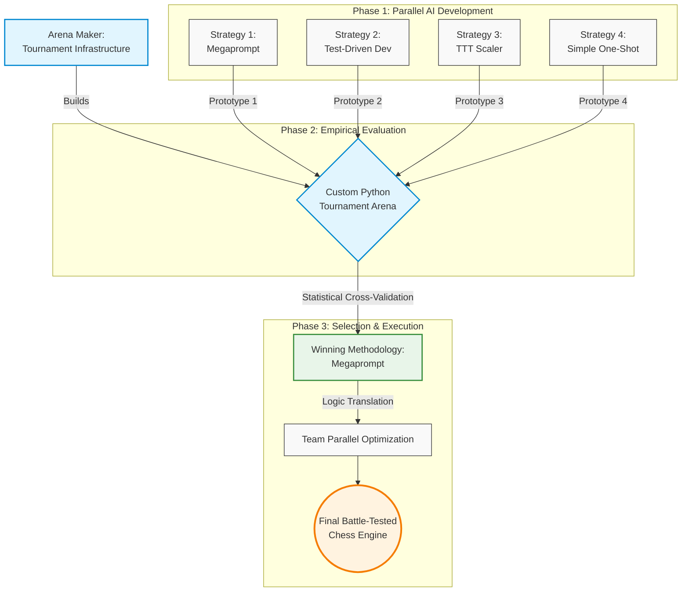

# Cubist Systematic Hackathon: Optimizing AI-driven Strategies 

## 1. Introduction

Yesterday at 6:00 pm, we were given an open-ended prompt to build a chess engine. However, being research-oriented students, we decided to approach the challenge not as a standard software engineering sprint, but as a rigorous quantitative research project. We realized that simply asking a Large Language Model to generate code would yield average results at best. Instead, we wanted to empirically discover the optimal way for human developers to collaborate with AI.

Our plan was to formulate four entirely distinct, AI-driven development strategies and use them in parallel to generate prototype engines. To evaluate them, we built a custom tournament arena to force these prototypes to compete against each other. By treating the prompting methodologies themselves as variables in a measurable experiment, we could systematically evaluate their logic, code stability, and compute efficiency. Only after cross-validating their performance and identifying the statistically superior approach would we use those insights to optimize our final, battle-tested chess engine.

## 2. The Four Prompting Methodologies
To eliminate bias and establish a proper control, we isolated our development into four distinct tracks. Each track was constrained to a single AI prompting philosophy.

### 1. The Zero-Shot Megaprompt
Instead of iterative coding, this strategy treated the AI as a high-level system architect that required maximum upfront context. Before generating a single line of code, we parallelized our entire five-person team to construct the ultimate master prompt. Each team member engaged independently with varying foundation AI models (e.g., Claude, GPT-4, Gemini) to brainstorm optimal chess engine architectures, search optimizations, and heuristic logic. By using different models, we ensured a diversity of algorithmic "thought." We then held a design review to cross-examine the outputs, extracting the most mathematically sound and performant ideas from each model while discarding redundancies. 

We merged these optimal components into a single, cohesive blueprint. This resulted in approximately 53 KB of exhaustive input planning documentation, including files like cubist_chess_megaprompt.md, DARWINIAN_AI.md, and custom heuristic guidelines. Finally, we fed this meticulously synthesized master document into a fresh Claude instance as a massive, zero-shot directive to see if comprehensive, human-curated synthesis could outperform iterative prompting.

### 2. Strict Test-Driven Development
This track focused entirely on code stability and logical correctness over strategic flair. The developer forced the AI into a strict "red-green-refactor" loop. The AI was explicitly forbidden from writing engine logic until it had first generated failing unittest blocks for piece movement, search bounds, and standard UCI protocol behavior.

### 3. The Dimensional Scaler
Our most experimental track asked a simple question: Can an AI generalize a search architecture across entirely different state spaces? The scaler was built in a three-stage lineage. First, the AI was prompted to build a perfectly tested Tic-Tac-Toe (TTT) engine. Next, we prompted it to scale that exact architecture to an 8x8 Checkers engine (handling forced captures and multi-jumps). Finally, it scaled the logic to Chess via a python-chess wrapper.

### 4. The Baseline MVP
To quantitatively measure how much our advanced prompting methodologies actually improved performance, we needed a baseline. For this track, the developer used a simple, low-effort, one-shot prompt: asking the AI to build a Minimum Viable Product (MVP) chess engine that could speak UCI. This served as our control variable—representing what a standard hackathon team might submit if they simply asked an LLM to "write a chess engine."

## 3. The resulting engines

### 1. The Zero-Shot Megaprompt
A chess engine has two parts: a **search** that looks many moves ahead, and an **evaluator** that scores each position it reaches (who's winning, by how much). We built one strong search — the standard modern recipe, looking as deep as possible in the time we have — and we froze it. What we let change was the evaluator, the "personality": one version cares most about material, another about king safety, another about controlling the center, and so on. Since every personality uses the same search, a tournament between them is a clean test of *which way of judging a position actually wins games*. 

Claude wrote seven personalities (pesto, balanced, aggressive_attacker, positional_grinder, fortress, material_hawk, pawn_storm) from the megaprompt, and we ran a round-robin arena (ARENA_LOG.md) to see which one played best. A patient, positional style came out on top. We then fed its lost games back to Claude, asked "what went wrong?", and it rewrote the personality (as reflexion_v1) to fix those specific mistakes. The new version won a follow-up tournament and eventually became our final engine.

Two recent research ideas shaped this. From *Eureka* (Ma et al., NVIDIA 2023) we take the result that an LLM can write evaluation functions as well as a human expert, so we let Claude invent the seven personalities instead of hand-crafting them. From *Reflexion* (Shinn et al., 2023) we take the result that language models improve faster when their feedback is written out in plain language rather than numerical gradients, so we hand Claude the PGN text of the losses and ask it to diagnose them instead of tuning weights by hand. The two-layer engine plus AI-refereed tournament is how those two ideas turn into something concrete.

### 2. Strict Test-Driven Development
Prioritize simple, testable search: negamax alpha-beta over legal moves with MVV-LVA capture ordering and a modest fixed depth, backed by an evaluator tuned so tests and UCI contracts stay honest. The strategy is shallow but consistent lookahead—prefer positions the static eval likes after a few plies, without investing in transpositions, quiescence, or aggressive pruning.

### 3. The Dimensional Scaler
Keep one game-agnostic alpha-beta core and the same iterative-deepening shell used from tic-tac-toe through checkers; for chess, only swap in a python-chess game wrapper and a richer static eval (material, PSTs, mobility, king tapering, small structure terms). The strategy is “same search recipe, new rules and eval”—reuse of architecture over chess-specific search tricks.

### 4. The Baseline MVP
Pack a full modern recipe into a single pipeline: iterative deepening with aspiration windows, TT, quiescence, null-move, LMR, check extensions, killers, history, and tapered PeSTO-style scoring, all driving one negamax-style search. The strategy is maximum conventional engine technique per clock tick under one coherent implementation, with time limits handled inside the same UCI-facing program.

## 4. Elo vs Stockfish (anchor calibration)

Each prototype was scored against **three fixed Stockfish opponents**: **skill 1, 3, and 5**, mapped in our harness to nominal anchor ratings **1000**, **1200**, and **1500** Elo. Match settings were identical for every engine: **80 ms per move**, **12 games per skill level** (36 calibration games per engine), eight balanced opening FENs, and alternating colors. The numbers below come from each engine’s `results.json` and the same pipeline as `elo-test/grade.py`.

---

## 4.1 Equations (how anchor Elo is turned into one number)

For one anchor with $W$ wins, $L$ losses, and $D$ draws, let $n = W+L+D$ and define the **empirical score**

$$
s = \frac{W + \frac{1}{2}D}{n}.
$$

The implementation clamps $s$ into $(10^{-4},\,1-10^{-4})$ so logarithms stay finite.

**Trinomial variance** of the score (treating each game as W / D / L), with $\mu = s$:

$$
\mathrm{Var}(s)
= \frac{W}{n}(1-\mu)^2 + \frac{D}{n}\left(\frac{1}{2}-\mu\right)^2 + \frac{L}{n}(0-\mu)^2.
$$

**Standard error of the mean score:**

$$
\mathrm{SE}(s) = \sqrt{\frac{\mathrm{Var}(s)}{n}}.
$$

The **Elo offset** of the candidate relative to the anchor implied by $s$ (logistic / Bradley–Terry form used in `grade.py`):

$$
\Delta = -400\,\log_{10}\!\left(\frac{1}{s}-1\right)
= 400\,\log_{10}\!\left(\frac{s}{1-s}\right).
$$

The **single-anchor estimate** of the candidate’s absolute rating:

$$
\hat{E} = E_{\text{anchor}} + \Delta
= E_{\text{anchor}} - 400\,\log_{10}\!\left(\frac{1}{s}-1\right).
$$

**Delta method** for the standard error in Elo space:

$$
\frac{\mathrm{d}\Delta}{\mathrm{d}s}
= \frac{400}{\ln 10 \cdot s(1-s)},
\qquad
\mathrm{SE}(\hat{E}) = \mathrm{SE}(s)\cdot \left|\frac{\mathrm{d}\Delta}{\mathrm{d}s}\right|.
$$

With three anchors $i=1,2,3$, estimates $\hat{E}_i$ and $\mathrm{SE}_i$ are combined by **inverse-variance weighting**:

$$
w_i = \frac{1}{\mathrm{SE}_i^2},
\qquad
E_{\text{final}} = \frac{\sum_i w_i \hat{E}_i}{\sum_i w_i},
\qquad
\mathrm{SE}_{\text{final}} = \frac{1}{\sqrt{\sum_i w_i}}.
$$

**95% confidence interval:** $E_{\text{final}} \pm 1.96\,\mathrm{SE}_{\text{final}}$.

---

### 4.2 Stockfish anchor results → combined Elo

Each cell is **W–L–D** over **12 games** from the **engine’s** perspective (wins / losses / draws against that Stockfish skill level).

| Engine | Calibrated Elo | 95% CI | vs Stockfish skill **1** (~1000) | vs Stockfish skill **3** (~1200) | vs Stockfish skill **5** (~1500) |
| --- | ---: | --- | :---: | :---: | :---: |
| **Strategy1** | **1447** | [1319, 1576] | 11–1–0 | 10–2–0 | 3–5–4 |
| **SimpleOneShot_bot** | **1195** | [1087, 1303] | 9–2–1 | 4–6–2 | 0–8–4 |
| **test-driven-development** | **863** | [737, 990] | 2–6–4 | 0–10–2 | 0–11–1 |
| **chess-ttt** | **779** | [615, 943] | 1–8–3 | 0–12–0 | 0–11–1 |

The **Calibrated Elo** column is \(E_{\text{final}}\) from §4.1. Cross-engine head-to-head play does **not** enter this number; it only comes from games vs Stockfish anchors.

## 5. Arena cross-validation (engine vs engine)

Head-to-head runs use **`elo-test/arena.py`**: **10 games** per pair, **80 ms/move**, **512 MB** cap, **2.0 s** hard move ceiling, **8-opening** book, colors alternate. Cells are **W–L–D from the row engine’s perspective**. Stored in each engine’s `results.json` → `cross_validation`; **does not** change Stockfish Elos (§4).

---

### 5.1 Arena parameters (cross-val)

| Setting | Value |
| --- | --- |
| Games per pair | 10 |
| Movetime | 80 ms |
| Engines | **Strategy1**, **OneShotOpus**, **test-driven-development**, **chess-ttt** |

---

### 5.2 Cross-validation matrix (four engines)

|  | **Strategy1** | **OneShotOpus** | **test-driven-development** | **chess-ttt** |
| --- | :---: | :---: | :---: | :---: |
| **Strategy1** | — | 4–0–6 | 10–0–0 | 10–0–0 |
| **OneShotOpus** | 0–4–6 | — | 8–0–2 | 10–0–0 |
| **test-driven-development** | 0–10–0 | 0–8–2 | — | 5–0–5 |
| **chess-ttt** | 0–10–0 | 0–10–0 | 0–5–5 | — |

---

### 5.3 Stockfish Elo vs net W−L in §5.2

Net = Σ (wins − losses) over the **three** opponents in §5.2 (draws omitted).

| Engine | Calibrated Elo (Stockfish, §4) | Net W−L (§5.2) |
| --- | ---: | ---: |
| **Strategy1** | 1447 | +24 |
| **OneShotOpus** | 1212 | +14 |
| **test-driven-development** | 863 | −13 |
| **chess-ttt** | 779 | −25 |

*OneShotOpus calibrated Elo from `strategies/OneShotOpus/results.json` (same `elo-test/` protocol as §4).*

---

## 6. Compute Cost & Efficiency Analysis

Elo alone doesn't tell the full story. A methodology that produces a 1400-Elo engine in one prompt is fundamentally different from one that reaches the same rating after 50 iterations and $10 in API costs. We tracked three compute dimensions for each strategy: cost to build the MVP, cost to fully optimize it, and the projected Elo ceiling of the optimized result.

### 6.1 MVP Build Cost

| Engine | Total Tokens | API Cost | Notes |
|---|---|---|---|
| chess-ttt | ~13,600 | ~$0.07 | Chess step only; game-agnostic search reused from TTT |
| TDD | ~30,000 | ~$0.13 | Full TDD loop: tests, implementation, UCI conformance |
| OneShotOpus | ~12,260 | ~$0.63 | Fewest tokens, but claude-opus-4-7 pricing ($75/M output) |
| Strategy1 | ~105,000 | ~$0.85 | 53 KB of planning docs + multi-model synthesis + internal tournament |

chess-ttt is the cheapest in absolute dollar terms because it reuses a verified search core and only replaces the game-specific layer. OneShotOpus has the lowest token count but the second-highest dollar cost — claude-opus-4-7 is expensive per token. Strategy1 consumes the most tokens by a wide margin due to its research-heavy upfront investment and multi-model prompting across the team.

### 6.2 Expected Optimization Cost

| Engine | Est. Tokens to Optimize | Est. API Cost | What's Left to Do |
|---|---|---|---|
| TDD | ~35,000 | ~$0.13 | Quiescence search, TT, LMR, null-move, PST tuning |
| chess-ttt | ~38,000 | ~$0.15 | Same features, but requires forking the shared search core |
| Strategy1 | ~76,000 | ~$0.30 | Reflexion v2/v3, endgame eval, tapered PST variants, time tuning |
| OneShotOpus | ~38,000 | ~$1.80–3.00 | Texel tuning, NNUE — expensive on Opus; ~$0.20 if delegated to Haiku |

TDD and chess-ttt are the cheapest to optimize because their search stacks have clear, well-understood gaps (no TT, no quiescence). Strategy1's optimization loop is more expensive because it runs internal tournaments to validate each change. OneShotOpus is the most expensive to optimize on-methodology because its remaining improvements (learned evaluation) are inherently token-heavy on a frontier model.

### 6.3 Projected Elo Ceiling

| Engine | Current Elo | Projected Ceiling | Gap to Close |
|---|---|---|---|
| Strategy1 | 1447 | ~1,500–1,700 | +50–250 |
| OneShotOpus | 1212 | ~1,500–1,700 | +290–490 |
| TDD | 863 | ~1,100–1,300 | +240–440 |
| chess-ttt | 779 | ~1,000–1,250 | +220–470 |

Strategy1's ceiling was originally projected at 1,300–1,400 in its COMPUTE.md. The PeSTO upgrade already pushed it past that to 1,447, so the ceiling has been revised upward to match OneShotOpus's architectural parity. Both are bounded by Python's runtime speed — a compiled Rust rewrite would push the ceiling significantly higher.

---

## 7. The Scoring Formula & Why We Chose Megaprompt

Raw Elo is only one axis. We designed a **Methodology Evaluation Score (MES)** that combines all six factors into a single number, weighted to reflect what actually matters for deciding which strategy to invest in.

### 7.1 The Formula

$$\text{MES} = 0.25 F_1 + 0.20 F_2 + 0.20 F_3 + 0.15 F_4 + 0.10 F_5 + 0.10 F_6$$

Each factor is normalized to [0, 1] using min-max scaling across the four engines. For performance factors (F1, F2, F5, F6), higher is better. For cost factors (F3, F4), lower cost maps to a higher score.

| Factor | Description | Weight | Direction |
|---|---|---|---|
| F1 | Calibrated Elo vs Stockfish anchors | **25%** | Higher = better |
| F2 | Cross-validation score vs other strategies | **20%** | Higher = better |
| F3 | API cost to build the MVP | **20%** | Lower = better |
| F4 | Expected API cost to fully optimize | **15%** | Lower = better |
| F5 | Projected Elo ceiling of optimized strategy | **10%** | Higher = better |
| F6 | Methodology quality score (hackathon rubric) | **10%** | Higher = better |

The first four factors carry 80% of total weight because engine strength and compute efficiency are the primary axes that determine which methodology is worth scaling. F5 and F6 are meaningful tie-breakers but are more speculative — F5 is a projection, F6 is qualitative.

**F6 — Methodology Rubric Score** is assessed on the four judging criteria (Chess Engine Quality, AI Usage, Process & Parallelization, Engineering Quality), scored 0–10 on each:

| Engine | Chess Quality | AI Usage | Process | Engineering | Total /40 |
|---|---|---|---|---|---|
| Strategy1 | 10 | 9 | 9 | 8 | **36** |
| TDD | 5 | 9 | 6 | 10 | **30** |
| chess-ttt | 4 | 8 | 7 | 9 | **28** |
| OneShotOpus | 8 | 5 | 3 | 5 | **21** |

### 7.2 Final Scores

| Engine | F1 | F2 | F3 | F4 | F5 | F6 | **MES** |
|---|---|---|---|---|---|---|---|
| **Strategy1** | 1.000 | 1.000 | 0.000 | 0.927 | 1.000 | 1.000 | **0.789** |
| **OneShotOpus** | 0.648 | 0.796 | 0.276 | 0.000 | 1.000 | 0.583 | **0.534** |
| **TDD** | 0.126 | 0.245 | 0.924 | 1.000 | 0.158 | 0.833 | **0.515** |
| **chess-ttt** | 0.000 | 0.000 | 1.000 | 0.993 | 0.000 | 0.778 | **0.427** |

### 7.3 Why Strategy1 Won

**Strategy1 scores 0.789** — a clear margin above second place (0.534). It earns perfect scores on F1, F2, F5, and F6, losing points only on MVP build cost (F3 = 0.000) because its 205K-token, multi-model research pipeline was the most expensive to construct. That cost is offset by strong scores everywhere else, particularly F4 (0.927) — once built, it is one of the cheaper strategies to continue optimizing.

The second and third place finishers — OneShotOpus (0.534) and TDD (0.515) — are nearly tied, revealing an interesting tension: OneShotOpus wins on engine quality but is penalized heavily on F4 (Opus optimization costs ~$2.40 per pass); TDD wins on compute efficiency but is limited by its weaker engine. Neither dominates the other.

chess-ttt scores lowest because its abstraction — one game-agnostic search core across three games — trades chess-specific strength for reusability. The penalty shows up directly in F1 and F2.

The full derivation, raw data, and a sensitivity analysis are in `strategy_evaluation/`.

---

## 8. Optimizing the megaprompt

Once the tournament picked megaprompt as the strongest strategy, we kept working on it. The two-layer design (one fixed search, one swappable personality) made it easy to split up: different people could work on different layers at the same time without stepping on each other. Three tracks ran at once.

### 8.1 Track 1: smarter personality (Workstream E)

One teammate ran the Reflexion loop. They took the 10 games `positional_grinder` had lost in the arena, fed the PGN text of those games back to Claude, and asked "what went wrong?". Claude found four patterns in the losses: no piece development, no castling, knights wandering to the rim, and queens coming out too early. It then wrote `reflexion_v1`, which is `positional_grinder` plus small bonuses and penalties for exactly those four patterns. A verification tournament confirmed the new version beat the old one 1-0 head to head, so `reflexion_v1` became the shipped personality.

### 8.2 Track 2: port to Rust for speed

In parallel, another teammate rewrote the full engine in Rust, keeping the same logic and the same `reflexion_v1` evaluator. Python is easy to write but slow. The Rust version runs the identical search around 200 times faster, which means it can look several plies deeper in the same amount of time. Deeper search on the same evaluator is free strength. A head to head between the Rust build and the Python build confirmed the Rust one wins at the same time control, and §9 below shows the full calibrated Elo.

### 8.3 Track 3: borrow the best parts from the other strategies

While those two tracks ran, we looked at what made the rival engines effective in their own games and folded the best parts back in. The Baseline MVP strategy (OneShotOpus) used tapered PeSTO evaluation tables, which we already had in our `pesto` personality and kept as part of `reflexion_v1`. The `shakmaty` Rust chess library had already been tested by another teammate on a separate engine, so the port used a known-working version from day one instead of fighting library issues. The strict test style from TDD carried over into the Rust test harness, so the new build could be trusted on the first run.

The result is one strategy with three people's work compounding at once. The personality keeps getting smarter through Reflexion, the search keeps getting faster through Rust, and the building blocks keep getting better by borrowing across strategies. None of these tracks would have worked without the two-layer architecture holding a clean boundary between search and evaluator.

---

## 9. Final performance of the megaprompt

The **megaprompt** track (Strategy 1) is best summarized by its **final, calibrated playing strength** on the same Stockfish anchor ladder used elsewhere in this document: skills **1 / 3 / 5** at nominal **1000 / 1200 / 1500** Elo, combined with inverse-variance weighting and the trinomial error model in `elo-test/grade.py` (see §4.1).

That **final** number comes from the **optimized Rust port** of the megaprompt engine (`strategies/Strategy1/engines/rust/`, UCI via `engine/run.sh`), which carries the same search-and-eval intent as the Darwinian MVE stack (PVS, iterative deepening, TT, quiescence, killers, history, LMR, PeSTO-style tapered eval, Reflexion-style corrections) but spends the movetime budget more effectively in native code.

**Calibrated Elo: 1740** (95% **CI [1597, 1883]**), from **60** total grading games (**20 per anchor**), **100 ms/move**, recorded in `strategies/Strategy1/engines/rust/results.json`. Anchor splits on that run: **20–0–0** vs skill 1, **18–1–1** vs skill 3, **15–3–2** vs skill 5 (wins–losses–draws from the engine’s perspective).

For comparison, the **Strategy1** row in §4.2 reflects the **Python** engine under the **80 ms / 12 games per anchor** sweep from an earlier calibration pass. Treat **1740** as the megaprompt line’s **reported final strength** when documenting outcomes from this repository; the two figures differ by **implementation** (Python MVE vs Rust), **time control**, and **games per anchor**, not by a change in the anchor definition.

---
