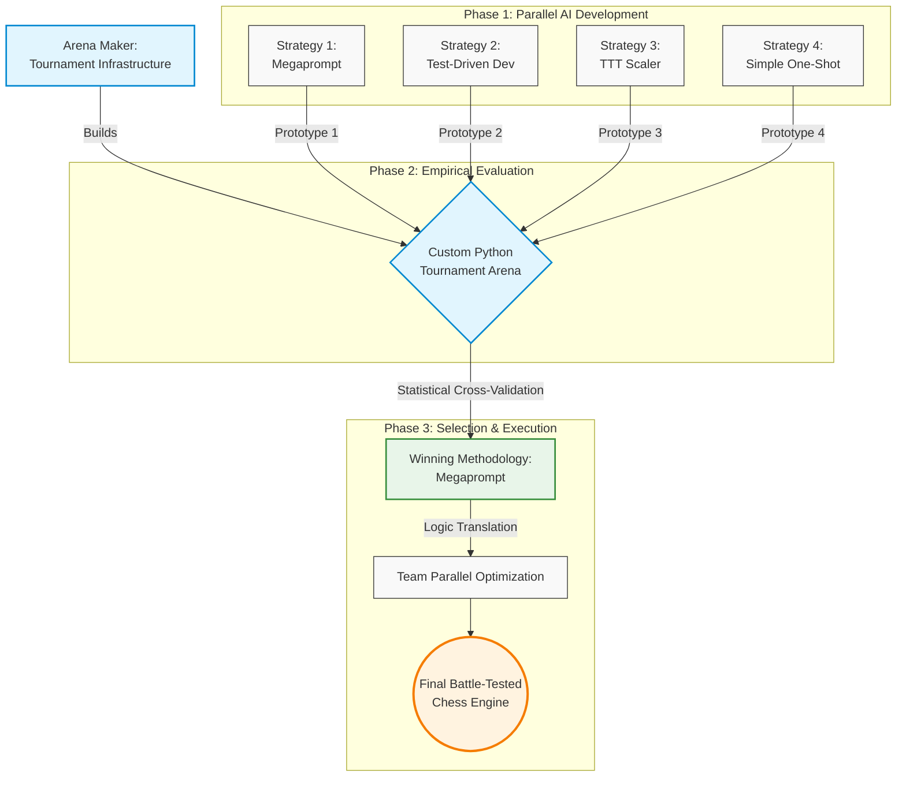

# Cubist Systematic Hackathon: Optimizing AI-driven Strategies 

## 1. Introduction

Yesterday at 6:00 pm, we were given an open-ended prompt to build a chess engine. However, being research-oriented students, we decided to approach the challenge not as a standard software engineering sprint, but as a rigorous quantitative research project. We realized that simply asking a Large Language Model to generate code would yield average results at best. Instead, we wanted to empirically discover the optimal way for human developers to collaborate with AI.

Our plan was to formulate four entirely distinct, AI-driven development strategies and use them in parallel to generate prototype engines. To evaluate them, we built a custom tournament arena to force these prototypes to compete against each other. By treating the prompting methodologies themselves as variables in a measurable experiment, we could systematically evaluate their logic, code stability, and compute efficiency. Only after cross-validating their performance and identifying the statistically superior approach would we use those insights to optimize our final, battle-tested chess engine.

## 2. The Four Prompting Methodologies
To eliminate bias and establish a proper control, we isolated our development into four distinct tracks. Each track was constrained to a single AI prompting philosophy.

### 1. The Zero-Shot Megaprompt
Instead of iterative coding, this strategy treated the AI as a high-level system architect that required maximum upfront context. Before generating a single line of code, we parallelized our entire five-person team to construct the ultimate master prompt. Each team member engaged independently with varying foundation AI models (e.g., Claude, GPT-4, Gemini) to brainstorm optimal chess engine architectures, search optimizations, and heuristic logic. By using different models, we ensured a diversity of algorithmic "thought." We then held a design review to cross-examine the outputs, extracting the most mathematically sound and performant ideas from each model while discarding redundancies.

We merged these optimal components into a single, cohesive blueprint. This resulted in approximately 53 KB of exhaustive input planning documentation, including files like Strategy1.md, DARWINIAN_AI.md, and custom heuristic guidelines. Finally, we fed this meticulously synthesized master document into a fresh Claude instance as a massive, zero-shot directive to see if comprehensive, human-curated synthesis could outperform iterative prompting.

### 2. Strict Test-Driven Development
This track focused entirely on code stability and logical correctness over strategic flair. The developer forced the AI into a strict "red-green-refactor" loop. The AI was explicitly forbidden from writing engine logic until it had first generated failing unittest blocks for piece movement, search bounds, and standard UCI protocol behavior.

### 3. The Dimensional Scaler
Our most experimental track asked a simple question: Can an AI generalize a search architecture across entirely different state spaces? The scaler was built in a three-stage lineage. First, the AI was prompted to build a perfectly tested Tic-Tac-Toe (TTT) engine. Next, we prompted it to scale that exact architecture to an 8x8 Checkers engine (handling forced captures and multi-jumps). Finally, it scaled the logic to Chess via a python-chess wrapper.

### 4. The Baseline MVP
To quantitatively measure how much our advanced prompting methodologies actually improved performance, we needed a baseline. For this track, the developer used a simple, low-effort, one-shot prompt: asking the AI to build a Minimum Viable Product (MVP) chess engine that could speak UCI. This served as our control variable—representing what a standard hackathon team might submit if they simply asked an LLM to "write a chess engine."

## 3. The resulting engines

### 1. The Zero-Shot Megaprompt
Treat chess as a two-layer problem: a shared, heavy search stack (PVS, deepening, TT, null-move, LMR, killers, history, quiescence) that maximizes depth per second, and a swappable evaluator (“personality”) that scores positions with different blends of material, piece–square structure, king safety, and style. Playing strength comes from search depth plus whichever eval profile is active, not from hand-tuned move rules at the UCI layer.

### 2. Strict Test-Driven Development
Prioritize simple, testable search: negamax alpha-beta over legal moves with MVV-LVA capture ordering and a modest fixed depth, backed by an evaluator tuned so tests and UCI contracts stay honest. The strategy is shallow but consistent lookahead—prefer positions the static eval likes after a few plies, without investing in transpositions, quiescence, or aggressive pruning.

### 3. The Dimensional Scaler
Keep one game-agnostic alpha-beta core and the same iterative-deepening shell used from tic-tac-toe through checkers; for chess, only swap in a python-chess game wrapper and a richer static eval (material, PSTs, mobility, king tapering, small structure terms). The strategy is “same search recipe, new rules and eval”—reuse of architecture over chess-specific search tricks.

### 4. The Baseline MVP
Pack a full modern recipe into a single pipeline: iterative deepening with aspiration windows, TT, quiescence, null-move, LMR, check extensions, killers, history, and tapered PeSTO-style scoring, all driving one negamax-style search. The strategy is maximum conventional engine technique per clock tick under one coherent implementation, with time limits handled inside the same UCI-facing program.

## 4. Elo vs Stockfish (anchor calibration)

Each prototype was scored against **three fixed Stockfish opponents**: **skill 1, 3, and 5**, mapped in our harness to nominal anchor ratings **1000**, **1200**, and **1500** Elo. Match settings were identical for every engine: **80 ms per move**, **12 games per skill level** (36 calibration games per engine), eight balanced opening FENs, and alternating colors. The numbers below come from each engine’s `results.json` and the same pipeline as `elo-test/grade.py`.

---

## 4.1 Equations (how anchor Elo is turned into one number)

For one anchor with $W$ wins, $L$ losses, and $D$ draws, let $n = W+L+D$ and define the **empirical score**

$$
s = \frac{W + \frac{1}{2}D}{n}.
$$

The implementation clamps $s$ into $(10^{-4},\,1-10^{-4})$ so logarithms stay finite.

**Trinomial variance** of the score (treating each game as W / D / L), with $\mu = s$:

$$
\mathrm{Var}(s)
= \frac{W}{n}(1-\mu)^2 + \frac{D}{n}\left(\frac{1}{2}-\mu\right)^2 + \frac{L}{n}(0-\mu)^2.
$$

**Standard error of the mean score:**

$$
\mathrm{SE}(s) = \sqrt{\frac{\mathrm{Var}(s)}{n}}.
$$

The **Elo offset** of the candidate relative to the anchor implied by $s$ (logistic / Bradley–Terry form used in `grade.py`):

$$
\Delta = -400\,\log_{10}\!\left(\frac{1}{s}-1\right)
= 400\,\log_{10}\!\left(\frac{s}{1-s}\right).
$$

The **single-anchor estimate** of the candidate’s absolute rating:

$$
\hat{E} = E_{\text{anchor}} + \Delta
= E_{\text{anchor}} - 400\,\log_{10}\!\left(\frac{1}{s}-1\right).
$$

**Delta method** for the standard error in Elo space:

$$
\frac{\mathrm{d}\Delta}{\mathrm{d}s}
= \frac{400}{\ln 10 \cdot s(1-s)},
\qquad
\mathrm{SE}(\hat{E}) = \mathrm{SE}(s)\cdot \left|\frac{\mathrm{d}\Delta}{\mathrm{d}s}\right|.
$$

With three anchors $i=1,2,3$, estimates $\hat{E}_i$ and $\mathrm{SE}_i$ are combined by **inverse-variance weighting**:

$$
w_i = \frac{1}{\mathrm{SE}_i^2},
\qquad
E_{\text{final}} = \frac{\sum_i w_i \hat{E}_i}{\sum_i w_i},
\qquad
\mathrm{SE}_{\text{final}} = \frac{1}{\sqrt{\sum_i w_i}}.
$$

**95% confidence interval:** $E_{\text{final}} \pm 1.96\,\mathrm{SE}_{\text{final}}$.

---

### 4.2 Stockfish anchor results → combined Elo

Each cell is **W–L–D** over **12 games** from the **engine’s** perspective (wins / losses / draws against that Stockfish skill level).

| Engine | Calibrated Elo | 95% CI | vs Stockfish skill **1** (~1000) | vs Stockfish skill **3** (~1200) | vs Stockfish skill **5** (~1500) |
| --- | ---: | --- | :---: | :---: | :---: |
| **Strategy1** | **1447** | [1319, 1576] | 11–1–0 | 10–2–0 | 3–5–4 |
| **SimpleOneShot_bot** | **1195** | [1087, 1303] | 9–2–1 | 4–6–2 | 0–8–4 |
| **test-driven-development** | **863** | [737, 990] | 2–6–4 | 0–10–2 | 0–11–1 |
| **chess-ttt** | **779** | [615, 943] | 1–8–3 | 0–12–0 | 0–11–1 |

The **Calibrated Elo** column is \(E_{\text{final}}\) from §4.1. Cross-engine head-to-head play does **not** enter this number; it only comes from games vs Stockfish anchors.

## 5. Arena cross-validation (engine vs engine)

Head-to-head runs use **`elo-test/arena.py`**: **10 games** per pair, **80 ms/move**, **512 MB** cap, **2.0 s** hard move ceiling, **8-opening** book, colors alternate. Cells are **W–L–D from the row engine’s perspective**. Stored in each engine’s `results.json` → `cross_validation`; **does not** change Stockfish Elos (§4).

---

### 5.1 Arena parameters (cross-val)

| Setting | Value |
| --- | --- |
| Games per pair | 10 |
| Movetime | 80 ms |
| Engines | **Strategy1**, **OneShotOpus**, **test-driven-development**, **chess-ttt** |

---

### 5.2 Cross-validation matrix (four engines)

|  | **Strategy1** | **OneShotOpus** | **test-driven-development** | **chess-ttt** |
| --- | :---: | :---: | :---: | :---: |
| **Strategy1** | — | 4–0–6 | 10–0–0 | 10–0–0 |
| **OneShotOpus** | 0–4–6 | — | 8–0–2 | 10–0–0 |
| **test-driven-development** | 0–10–0 | 0–8–2 | — | 5–0–5 |
| **chess-ttt** | 0–10–0 | 0–10–0 | 0–5–5 | — |

---

### 5.3 Stockfish Elo vs net W−L in §5.2

Net = Σ (wins − losses) over the **three** opponents in §5.2 (draws omitted).

| Engine | Calibrated Elo (Stockfish, §4) | Net W−L (§5.2) |
| --- | ---: | ---: |
| **Strategy1** | 1447 | +24 |
| **OneShotOpus** | 1212 | +14 |
| **test-driven-development** | 863 | −13 |
| **chess-ttt** | 779 | −25 |

*OneShotOpus calibrated Elo from `strategies/OneShotOpus/results.json` (same `elo-test/` protocol as §4).*

---
